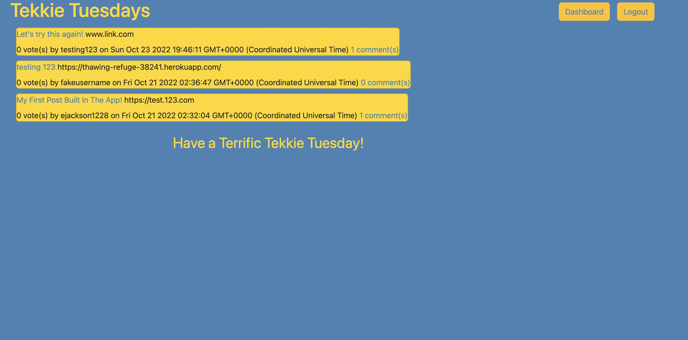

 [] 
# <h1 align="center">Tekkie-Tuesdays</h1>
<a href="https://thawing-refuge-38241.herokuapp.com/">Visit the app here!</a>

 

 

## Description
A CMS application that allows users to share blog posts about the latest tech news. Anyone can view the application but in order to post, comment, and vote on posts, one must create an account and log in.
  
## Table of Contents
  - [Description](#description)
  - [Installation](#installation)
  - [Usage](#usage)
  - [License](#license)
  - [Contributors](#contributors)
  - [Questions](#questions)

## Installation
Connect to a database by using environment variables. Use db/schema.sql as a source in your DB. Start the server with `npm start`. 

## Usage
Post, Comment, and share content with other users by creating an account.

## License
[]This application is covered under the MIT license. (https://opensource.org/licenses/MIT)

## Contributors
Sequelize, express, handlebars, mysql2, dotenv, bcrypt, heroku

## Questions? Contact me:
GitHub: https://github.com/ejackson1228/  
Email: ejackson1228@gmail.com